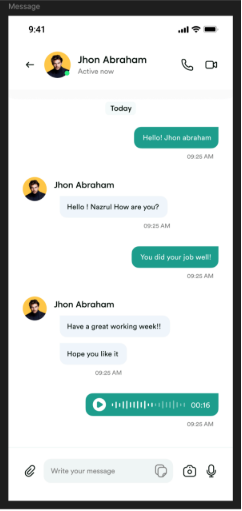

# Chat UI Design

A modern chat interface built with Flutter, featuring a clean design, message bubbles, avatars, and input controls.

## Features

- Custom app bar with avatar, name, and status
- Incoming and outgoing message bubbles
- Audio message bubble with play icon and waveform placeholder
- Date separator chip
- Message input field with attachment, image, camera, and mic icons
- Responsive layout

## Getting Started

### Prerequisites

- [Flutter SDK](https://docs.flutter.dev/get-started/install)
- Android Studio, VS Code, or any preferred IDE

### Installation

1. Clone the repository:
   ```sh
   git clone <https://github.com/pramod729/Flutter-Assignment>
   cd ui_design
   ```
2. Get dependencies:
   ```sh
   flutter pub get
   ```
3. Run the app:
   ```sh
   flutter run
   ```

## Screenshots




